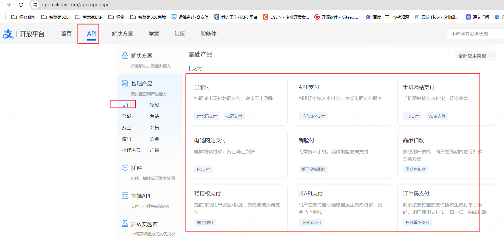

## 支付宝支付对接

[支付产品 点我](https://open.alipay.com/api#openapi)



---

[支付宝沙箱环境](https://open.alipay.com/develop/sandbox/app)
：沙箱环境是协助开发者进行接口开发及主要功能联调的模拟环境，目前仅支持网页/移动应用和小程序两种应用类型。在沙箱完成接口调试后，请务必在正式环境进行完整的功能验收测试。

---

[社区](https://open.alipay.com/portal/forum/mainArticle/hot)
：对接过程中碰到问题了，这里可以搜原因以及解决方案!!!

---

<details>
<summary>搞清楚【支付宝商家平台】以及【支付宝开放平台】</summary>

#### 支付宝商家平台

- **服务对象**：主要服务于已经注册成为支付宝商户的商家，包括但不限于线上店铺、线下实体店等。
- **功能特点**：
    - 账户管理：可以查看交易记录、账户余额、资金流水等信息。
    - 交易管理：处理退款、查询订单状态等。
    - 营销工具：提供营销活动设置，如优惠券、满减等。
    - 账户管理：提供销售数据、客户行为分析等功能，帮助商家更好地了解业务情况。
    - 账户管理：为商家提供客服支持，解决使用过程中的问题。

#### 支付宝开放平台

- **服务对象**：面向开发者、合作伙伴以及需要接入支付宝支付能力的企业或个人，提供API接口和技术文档。
- **功能特点**：
    - API接口：提供丰富的API接口，如支付、转账、账单查询等，方便开发者快速集成支付宝支付功能。
    - 技术文档：详细的开发指南、接口说明文档等，帮助开发者理解如何使用支付宝的各项服务。
    - 应用市场：为开发者提供一个展示自己应用的平台，同时也能发现和接入其他第三方应用。
    - 合作伙伴计划：为合作伙伴提供更多的商业机会和技术支持，促进生态建设。

简单来说，支付宝商户后台更多地关注于商家日常运营所需的各种功能和服务；而支付宝开放平台则更侧重于技术层面的支持，旨在通过开放接口和技术资源来促进生态合作与发展。两者相辅相成，共同服务于支付宝生态系统中的不同角色。
</details>

**读了上面的搞清楚【支付宝商家平台】以及【支付宝开放平台】就应该知道了，对接支付宝支付要先去注册商家平台和支付宝开放平台！！！
**

---

> 支付宝支付对接流程主要分为以下几个步骤，这里提供一个大致的指南。具体操作时，请参考支付宝官方文档或联系支付宝技术支持获取最新和最准确的信息

#### 1. 注册与开通服务

- **注册账号**：首先需要在[支付宝开放平台](https://open.alipay.com)注册开发者账号。
- **实名认证**：完成个人或企业的实名认证，这是使用支付宝支付功能的前提条件。
- **创建应用**：在支付宝开放平台创建你的应用，并获取AppID等必要的开发信息。
- **签约产品**：根据业务需求选择合适的支付产品（如即时到账、担保交易等），并完成签约流程。

#### 2. 配置支付环境

- **配置API密钥**：在支付宝开放平台中为你的应用配置公私钥对，确保支付接口的安全性。
- **设置回调地址**：设置支付成功后的回调URL，以便接收支付结果通知。
- **开发环境搭建**：如果需要，可以先在沙箱环境中进行测试，确保一切正常后再上线到生产环境。

---

### 实战（不想看上面，直接看实战部分也行）

接下来拿**电脑网站支付**为例

[第一步看 接入准备](https://opendocs.alipay.com/open/270/01didh?pathHash=a6ccbe9a)

[第二步看 沙箱调试](https://opendocs.alipay.com/open/00dn7o?pathHash=c1e36251)

[第三步看 API列表](https://opendocs.alipay.com/open/59da99d0_alipay.trade.page.pay?scene=22&pathHash=e26b497f)

[第四步看 服务端SDK](https://opendocs.alipay.com/open/02np93)

---

#### 三种SDK可供使用，强烈推荐使用alipay-easysdk

[alipay-sdk-java 点我查看教程](https://github.com/alipay/alipay-sdk-java-all/blob/master/v2/README.md)

```xml

<dependency>
  <groupId>com.alipay.sdk</groupId>
  <artifactId>alipay-sdk-java</artifactId>
  <version>4.39.231.ALL</version>
</dependency>
```

[使用示例=》SdkV2Controller](src/main/java/com/enba/ali/pay/controller/SdkV2Controller.java)

---

[alipay-sdk-java-v3 点我查看教程](https://github.com/alipay/alipay-sdk-java-all/blob/master/v3/README.md)

```xml

<dependency>
  <groupId>com.alipay.sdk</groupId>
  <artifactId>alipay-sdk-java-v3</artifactId>
  <version>3.1.14.ALL</version>
</dependency>

```

[使用示例=》SdkV3Controller](src/main/java/com/enba/ali/pay/controller/SdkV3Controller.java)

---

[alipay-easysdk 点我查看教程](https://github.com/alipay/alipay-easysdk/tree/master)

```xml

<dependency>
  <groupId>com.alipay.sdk</groupId>
  <artifactId>alipay-easysdk</artifactId>
  <version>2.2.3</version>
</dependency>
```

[使用示例=》EasySdkController](src/main/java/com/enba/ali/pay/controller/EasySdkController.java)

---

**任何疑问添加微信咨询**
